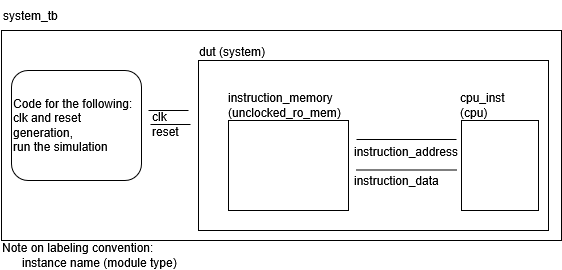

# Phase 2: Decode

In this phase, you'll practice writing SystemVerilog while taking a step towards writing code to build a RISC-V CPU.

Provided is some starter code that mostly overlaps the code provided in Phase 1.  This time, it's useful to understand what the code provided to you is.  In the below diagram, you can see there's a top level file (system_tb.sv) that is a testbench.  It instantiates a module of type system (found in system.sv).  The module system consists of unclocked_ro_mem.sv, which serves as the instruction memory, and cpu.sv, which is our start of a cpu (what you'll need to modify).  Note that unclocked_ro_mem is parameterized with a file name (init.mem) -- that file consists of the machine code for an RISC-V program, in hex, with one instruction per line.  It reads that into memory.



For cpu.sv, there are three main sections (indicated with comments in the file).  The first is fetching instructions from memory (so, it'll increment a register called pc), and then assign the data read from memory to a signal, s_id_instr.  

**(Your Task)** The second section is to decode the instructions.  See below for details.

The last section is just printing stuff out -- it'll print out the instruction based on how you decoded it (so, ideally, equivalent to the originating assembly program).  It depends on a variable **instr_string** being set (which is the output from the second section that you had to write).


## Main Task: Fill in Decode Logic

In the provided code, the 32 bit instruction as read from memory is in a variable, s_id_instr.  From this, you need to 
figure out 1) which instruction it is (set as string in instr_string), and 2) extract out each individual component of the instruction (i.e., rs1, rs2, rd, fun3, fun7, immed).  

The signals you should use (assign to) are provided and already defined (e.g., s_id_rs1). 

**Variable Naming Convention**

We'll use a naming convention for this project (all phases).
* First part: Variables that start with s_ represent a signal / wire that is not registered.  Variables that start with r_ represent a registered signal.
* Second part: we'll incude the stage in the variable name.  So, for this phase, we'll use _id_ to represent decode (though, we're not really doing stages yet)
* Third part is the name.  So, s_id_opc is a signal/wire, that's for the id stage, and called opc

**Recommended Approach**

You can do this in a variety of ways, here's our suggestion:

Step 1) Extract individual fields regardless of instruction type.  You'll note that in RISC-V, opc, fun3, fun7, rs1, rs2, and rd, are always in the same bit positions for the instructions that use that.  e.g., opc is always bits 6 down to 0.  Extract out the fields, ignoring the instruction type (if the instruction doesn't use it, it doesn't matter if you assigned a value to it that is nonsense). 

For immediates, they depend on the instruction, so assign each signal of the corresponding name (e.g., s_id_immedi for I type) based on the decoding for that instruction group (e.g., s_id_immedi or s_id_immedj). Sign extend them to 32 bits.  

In verilog, you can do this to assign outside of a always_comb/always_ff block (note -- you need to do this outside of one of those blocks since Icarus Verilog does not support slicing with constants (e..g., [6:0]), which you'll need, inside of an always_* block):
```
assign lhs = rhs;
```

And slicing will be useful -- e.g., signalname[6:0]

You can sign extend in SystemVerilog with the $signed function like:
```
data_out = $signed(data_in); 
```

Step 2) Set s_id_immed.  Since you extracted out s_id_immedi, s_id_immedj, etc. indescriminantly, now you need to set the single variable s_id_immed based on the instruction.  Here, create and always_comb block, and use a case statement within it (switching on opc and matching on the values in the provided enum), as shown in the example below

```
case (opc)
  S_TYPE: s_id_immed = s_id_immeds;
  ...
```

Step 3) Assign the instruction string based on instruction type.  Create another always_comb block.  You'll have a case statement (like above) using opc, but you'll also need to look at fun3 and fun7 to determine which specific instruction.  Assign to s_id_instr_string the instruction name.  For those that are unknown (which will be the default in case statements), set it to "unknown".

```
instr_string = "add"
```

Note: you can have case statements without enum:
```
case(s_id_fun3)
    3'b000:
    ...
```


## How to Test

We provide an assembly program, sample.S, which tests a few instructions.  We also provide the output from it (sample_log.log).  Note, it runs for longer than the program needs, so you'll see a bunch of lines that you can ignore, like:

```
pc=0x00000010, instr=0x00000000 (other)
```

How to run:

To create the mem initialization file (replace sample with whatever assembly file name you create is called, minus the .S extension):  
```
./make_init_mem.sh sample > init.mem
```

To check syntax with Verilator (since you're only modifying cpu.sv, only check that one): 
```
verilator --lint-only cpu.sv
```

To compile the verilog with Icarus Verilog:
```
iverilog -g2012 -o system_tb.out -c file_list.txt
```

To run the simulation (the first will print to stdout, the second redirects to a log file that you can use more/cat to view):
```
./system_tb.out
./system_tb.out > sample_log.log
```

To view the waveform (if desired)
```
gtkwave simulation_results.vcd &
```

You **must** create a new file that is an assembly program that will test more instructions (call it **mytest.S**).  Note: you do not need to run the assembly program (e.g., in qemu) to check they do something.  Just, generate the machine code and then run the verilog code.

## AI Use

You need to create a new file AI-use-statement.md and include a statement on how exactly you used AI (tools, prompt examples).

Note -- acceptable uses:
* Learning SystemVerilog -- e.g., provide an example of slicing in SystemVerilog.
* Code completion e.g., if I start typing something and it recognisizes a pattern, it will suggest some code to use that matches that pattern.

Note -- unacceptable uses:
* Asking it to create whole verilog code
* Proving the instructions (or code) from the assignment as asking it to complete all or part.

If in doubt, ask.  


## Submission / Grading

Add any new files you created to the git repo (at least mytest.S), and commit/push all changes.  Do not include temporary files.  We include a .gitignore that should catch these.

Submit the URL in canvas as the submission when you are completed

Rubric:
10 points total

1 point for file AI_use_statement.md

7 points is the output from running the verilog with the program provided (sample.S) works.  
* SystemVerilog code that builds without errors - 3 points
* SystemVerilog runs with some output - 1 point
* SystemVerilog produces the correct output - 2 points
* Your test assembly program compiles without errors - 1 point

2 points are based on an assembly program we wrote (and are not sharing) where we test all instructions.  You get 2 points if works completely correctly, and partial credit based on the degree to which our test program works.  
